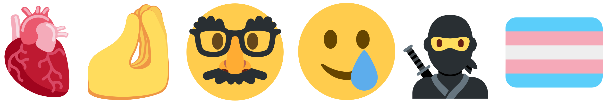

# Twemoji Awesome 🤡


Like [Font Awesome](https://fontawesome.com), but for
[Twitter Emojis](http://twitter.github.io/twemoji/) 🎉

Supports **v13.0** emojis (more than 3,000!) 💪

You can refer to [this cheatsheet](cheatsheet.md) for a complete  📝




# ✅ Usage

Download [this](twemoji-awesome.css) stylesheet and include it to your website.

```html
<link ref="stylesheet" href="path/to/twemoji-awesome.css">
```

> That's all ! You can now start using **Twemoji Awesome** 🥳

| Emoji                                                                             | Emoji Cheatsheet | HTML                                            |
| --------------------------------------------------------------------------------- | ---------------- | ----------------------------------------------- |
|  | `calendar`       | `<i class="twa twa-calendar"></i>`              |
|  | `flexed-biceps`  | `<i class="twa twa-flexed-biceps"></i>`         |
|  | `grimacing-face` | `<i class="twa twa-2x twa-grimacing-face"></i>` |


# 📝 Notes 

1️⃣ Emoji styles are defined in **twemoji-awesome.css**. Like
[Font Awesome](https://fontawesome.com) which uses `fa-*`, Twemoji Awesome uses
`twa-*` for class names.

2️⃣ You can find a full cheatsheet [here](cheatsheet.md), where all emojis (13.0)
are listed with their corresponding name.

3️⃣ You can change the emoji size with `twa-lg`, `twa-2x`, `twa-3x`, `twa-4x` and
`twa-5x`.


# 🛠️ Generating

## 😴 TL;DR

To generate a new `twemoji-awesome.css` stylesheet from the last emojis version:
```
make all
```

> Fetches emojis, builds the stylesheet and builds the cheatsheet.

## 🔍 1. Fetching emojis

The following command will fetch the last [emoji.json](https://github.com/amio/emoji.json)
version and filter Twemojis from it.
```
make emoji
```

## 🎨 2. Building the stylesheet

The following command will generate the stylesheet corresponding to the
`emoji.json` file.
```
make css
```

## 📝 3. Building the cheatsheet

If you also need to generate a brand new cheatsheet *(eg. after an update)*,
the following command will do it for you! 🙏
```
make cheatsheet
```


# 🙏 Acknowledgements

- [Elle Kasai](https://github.com/ellekasai) for the CSS basis
(**twemoji-basis.css**), the documentation from which this one is inspired and
the original idea of **Twemoji Awesome**.
- [emoji.json](https://github.com/amio/emoji.json) for the complete list of 
emojis (with both their names and codes).
- [Twemoji](https://github.com/twitter/twemoji) for the emojis SVGs.